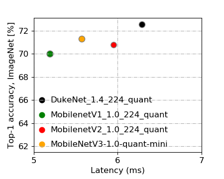

# DukeNet
A mobile Vision Model for DSP. The time constraint is <7ms on a Qualcomm Hexagon DSP.

## Model Description
It's inspired by MobileNetv3. We add the following modifications for Qualcomm Hexagon DSP.
+ Remove all of the ‘fancy’ activations (e.g. Hard swish, ReLU6) which may either incompatible with hardware or induce significant accuracy drop after quantization.
+ Replace 5x5 depthwise separable convolutions with their 3x3 counterparts as they are not supported by the NNAPI.
+ Remove the final FC layer to reduce the number of parameters.
+ Scale up the model by 1.4x to fully utilize the given computation budget.

## Performance of Quantized models and Floating-point models
| Model                     | Top-1 Accuracy (%) | Top-5 Accuracy (%) | \# Parameters | MACs     | Latency1 |
| ------------------------- | ------------------ | ------------------ | ------------- | -------- | ------- |
| [DukeNet-1.4](https://github.com/newwhitecheng/dukenet/blob/master/Model1019_72.56_6.2ms/DukeNet-fp32.tflite)               | 73.53              | 91.75              | 3.96 M        | 410.33 M | 18.89ms |
| [DukeNet-1.4-quantized](https://github.com/newwhitecheng/dukenet/blob/master/Model1019_72.56_6.2ms/DukeNet-uint8.tflite)     | 73.12              | 91.79              | 3.96 M        | 410.33 M | 6.29ms  |
| MobileNetV3-1.02          | 75.2              | N/A                | 5.4M          | 217M     | 570.84ms4|
| MobileNetV3-1.0-quantized2| 73.9              | N/A                | 5.4M          | 217M     | 703.42ms4|
| MobileNetV3-1.0-mini2          | 72.3         | N/A                | 3.9M          | 209M     | 19.89ms |
| MobileNetV3-1.0-quantized-mini2| 71.3         | N/A                | 3.9M          | 209M     | 5.57ms  |
| MobileNetV2-1.42            | 75.0            | 92.5               | 6.06M         | 582M     | 21.02ms |
| MobileNetV2-1.03           | 71.8            | 90.6               | 3.47M         | 300M     | 19.98ms |
| MobileNetV2-1.0-quantized3 | 70.8            | 89.9               | 3.47M         | 300M     | 5.95ms  |
| MobileNetV1-1.03           | 71.0            | 89.9               | 4.24M         | 569M     | 17.15ms |
| MobileNetV1-1.0-quantized3 | 70.0            | 89.0               | 4.24M         | 569M     | 5.19ms  |
| MnasNet-0.753              | 71.72           | 90.17              | 2.9M          | 227M     | 26.88ms |
| MnasNet-1.03               | 74.08           | 91.75              | 3.9M          | 315M     | 27.54ms |
| MnasNet-1.33               | 75.24           | 92.55              | N/A           | N/A      | 27.59ms |

1All latencies are measured on LG G8 ThinQ using the [label image](https://github.com/tensorflow/tensorflow/tree/master/tensorflow/lite/examples/label_image) program provided by tensorflow lite examples with nnapi enabled, running on Hexgon 690 DSP. Each test run involves 50 warmup runs and 1000 runs whose average latency is listed.

2Pretrained Model, accuracy, MAC and Parameter data are from [https://github.com/tensorflow/models/tree/master/research/slim/nets/mobilenet](https://github.com/tensorflow/models/tree/master/research/slim/nets/mobilenet), 'mini' stands for minimalistic models, which have the same per-layer dimensions characteristic as MobilenetV3 while drop advanced blocks (squeeze-and-excite units, hard-swish, and 5x5 convolutions).

3Pretrained Model, accuracy data are from [https://www.tensorflow.org/lite/guide/hosted_models](https://www.tensorflow.org/lite/guide/hosted_models). Parameter and MAC count are from [https://github.com/tensorflow/tpu/tree/master/models/official/mnasnet](https://github.com/tensorflow/tpu/tree/master/models/official/mnasnet) and [https://github.com/tensorflow/models/tree/master/research/slim/nets/mobilenet] (https://github.com/tensorflow/models/tree/master/research/slim/nets/mobilenet).

412.01ms on CPU for fp32 version, 11.98ms on CPU for uint8 version

## Version
**Alpha Release v1.1 (10/24)**
+ Accuracy finetuned to 73.53% for fp32 model and 73.12% for quantized model.
Latency: 6.29ms.

**Alpha Release v1.0 (10/21)**
+ Accuracy: 72.56%, Latency: 6.2ms (meet the requirements - >71% Top-1 on ImageNet, <7ms)
+ model folder: [DukeNet-1.4](https://github.com/newwhitecheng/dukenet/blob/master/Model1019_72.56_6.2ms)      
+ benchmark log on cpu
+ benchmark log on dsp with nnapi enabled
+ presentation [ppt slides](https://github.com/newwhitecheng/dukenet/blob/master/g3doc/dukenet_presentation.pptx)      

## Team Information
+ team name: foreverDuke
+ team member: Tunhou Zhang, Shiyu Li, Hsin-Pai Cheng

