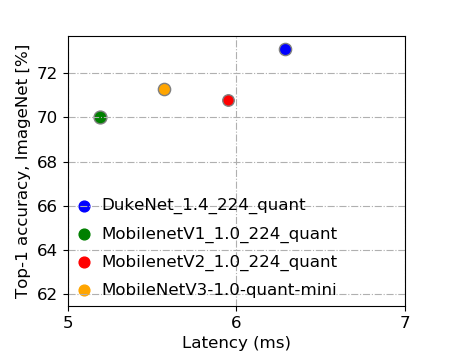

# DukeNet
a mobile vision model for DSP

## model description
It's inspired by MobileNetv3. We add the following modifications for Qualcomm Hexagon DSP.
+ Remove all of the ‘fancy’ activations (e.g. Hard swish, ReLU6) which may either incompatible with hardware or induce significant accuracy drop after quantization.
+ Replace 5x5 depthwise separable convolutions with their 3x3 counterparts as they are not supported by the NNAPI.
+ Remove the final FC layer to reduce the number of parameters.
+ Scale up the model by 1.4x to fully utilize the given computation budget.

## Performance of Quantized models
| Model                     | Top-1 Accuracy (%) | Top-5 Accuracy (%) | \# Parameters | MACs     | Latency |
| ------------------------- | ------------------ | ------------------ | ------------- | -------- | ------- |
| DukeNet-1.4               | 72.99              | ?                  | 3.96 M        | 410.33 M | 16.8ms  |
| DukeNet-1.4-quantized     | 71.81              | 90.83              | 3.96 M        | 410.33 M | 6.29ms  |
| MobileNetV3-1.0           | 75.2               | N/A                | 5.4M          | 219M     | ?       |
| MobileNetV3-1.0-quantized | N/A                | N/A                | 5.4M          | 219M     |         |
| MobileNetV2-1.4           |                    |                    |               |          |         |
|                           |                    |                    |               |          |         |
|                           |                    |                    |               |          |         |

## Version
**Alpha Release v1.0 (10/21)**
+ model folder: Model1017_71.7_6.39
+ benchmark log on cpu
+ benchmark log on dsp with nnapi enabled.
+ note: meet the requirements - >71% Top-1 on ImageNet, <7ms

**v1.1**
+ coming soon

## team information
+ team name: foreverDuke
+ team member: Tunhou Zhang, Shiyu Li, Hsin-Pai Cheng

